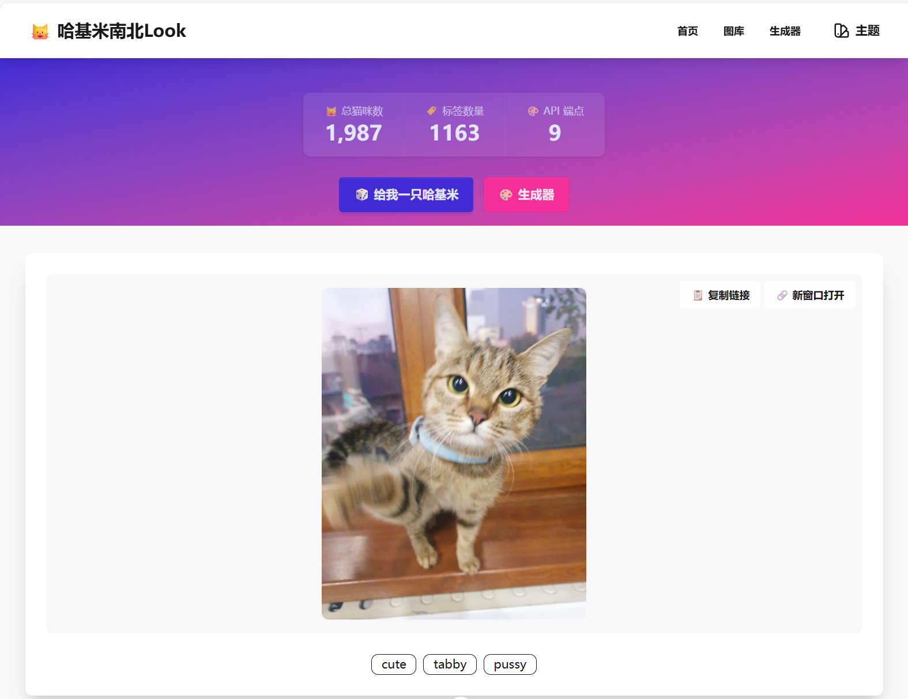
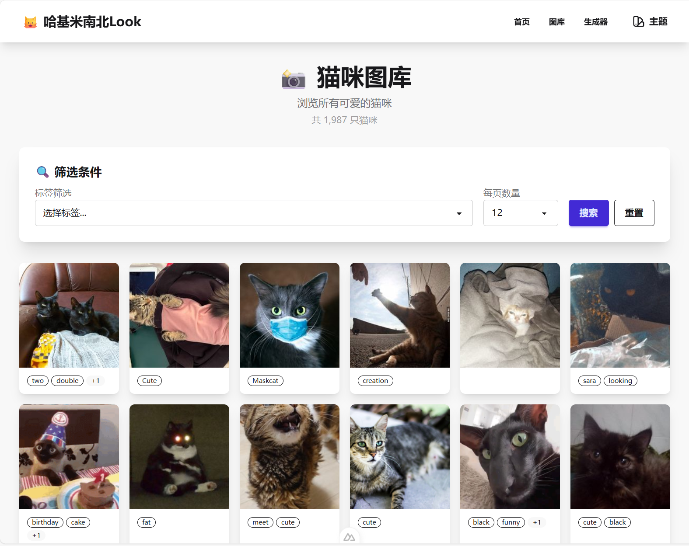
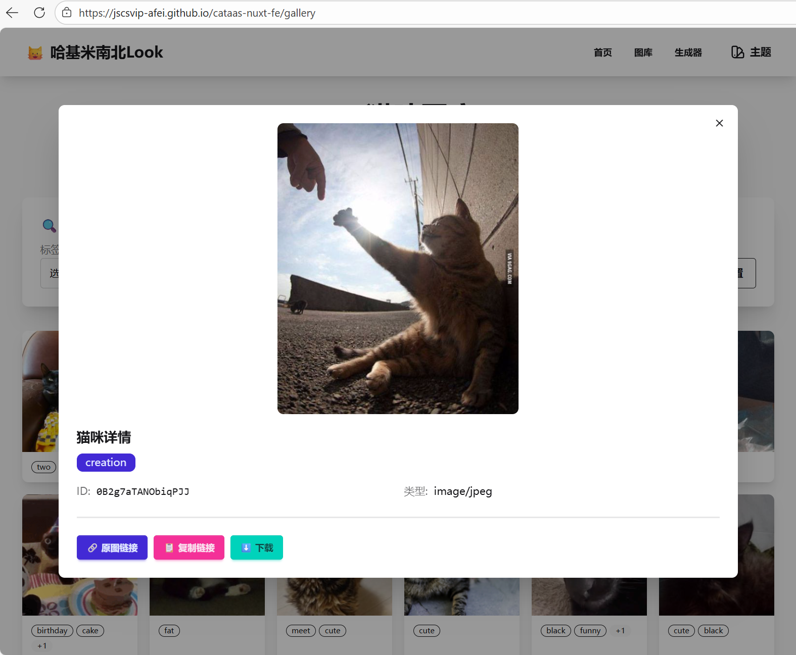
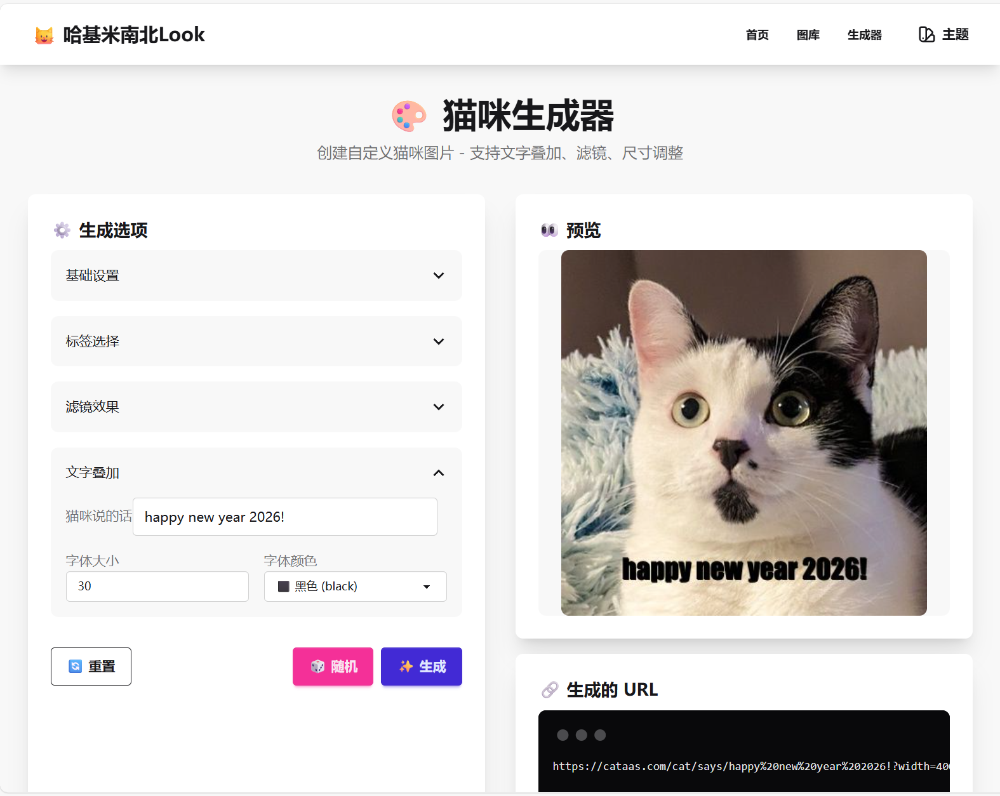

# 🐱 哈基米南北Look - 猫咪图片生成网站

一个基于 [CATAAS (Cat as a Service)](https://cataas.com) API 的可爱猫咪图片生成网站，使用 Nuxt 4 + DaisyUI 构建。


## ✨ 功能特性

### 🎲 首页 - 随机猫咪
- 一键获取随机可爱猫咪图片
- 按标签快速筛选（cute、orange、black、white、gif 等）
- 显示猫咪总数和标签统计
- 复制链接 / 新窗口打开



### 📸 图库 - 猫咪浏览
- 分页浏览所有猫咪图片
- 下拉框标签筛选（支持多选）
- 点击查看猫咪详情弹窗
- 图片加载状态显示





### 🎨 生成器 - 自定义猫咪
- **基础设置**：图片类型（正方形/中等/小图）、格式（图片/GIF）、自定义尺寸
- **标签选择**：从 1000+ 标签中选择
- **滤镜效果**：模糊、黑白、复古、反色、油画、像素化、自定义（亮度/饱和度/色相）
- **文字叠加**：自定义文字内容、字体大小、字体颜色
- 历史记录保存
- 一键复制 URL / 下载图片



### 🌓 主题切换
- 支持深色/浅色主题切换
- 主题偏好本地存储


## 🔌 API 端点

本项目完整集成了 CATAAS 的所有 API：

| 端点 | 描述 | 使用位置 |
|------|------|---------|
| `GET /cat` | 随机猫咪 | 首页、生成器 |
| `GET /cat/{id}` | 指定ID猫咪 | 首页、图库详情 |
| `GET /cat/{tag}` | 按标签随机 | 首页标签筛选 |
| `GET /cat/says/{text}` | 带文字的猫咪 | 生成器 |
| `GET /cat/{tag}/says/{text}` | 标签+文字 | 生成器 |
| `GET /cat/{id}/says/{text}` | ID+文字 | 生成器 |
| `GET /api/cats` | 猫咪列表 | 图库 |
| `GET /api/count` | 猫咪总数 | 首页统计 |
| `GET /api/tags` | 所有标签 | 图库、生成器 |

## 🛠️ 技术栈

- **框架**: [Nuxt 4](https://nuxt.com/)
- **UI 组件**: [DaisyUI](https://daisyui.com/)
- **样式**: [Tailwind CSS](https://tailwindcss.com/)
- **语言**: TypeScript
- **API**: [CATAAS](https://cataas.com)

## 🚀 快速开始

### 安装依赖

```bash
npm install
```

### 开发模式

```bash
npm run dev
```

访问 `http://localhost:3000`

### 生产构建

```bash
npm run build
```

### 预览生产构建

```bash
npm run preview
```

## 📁 项目结构

```
├── app/
│   ├── app.vue              # 应用入口
│   ├── tailwind.css         # Tailwind 样式
│   ├── components/
│   │   └── ThemeToggle.vue  # 主题切换组件
│   ├── layouts/
│   │   └── default.vue      # 默认布局（导航栏）
│   └── pages/
│       ├── index.vue        # 首页 - 随机猫咪
│       ├── gallery.vue      # 图库 - 猫咪浏览
│       └── generator.vue    # 生成器 - 自定义猫咪
├── public/
│   └── robots.txt
├── nuxt.config.ts           # Nuxt 配置
└── package.json
```

## 📝 License

MIT

## 🙏 致谢

- [CATAAS](https://cataas.com) - 提供可爱的猫咪 API
- [DaisyUI](https://daisyui.com) - 精美的 UI 组件库
- [Nuxt](https://nuxt.com) - 强大的 Vue 框架
